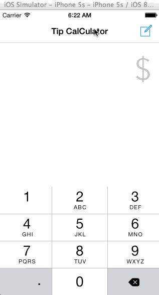

# Review-prework
This is a Tip Calculator application of prework at coderschool.vn
 
Time spent: 8 hours

Completed:
 + Required: User can enter a bill amount, choose a tip percentage, and see the tip and total values.  
 + Required: Settings page to change the default tip percentage. 
 - Optional: UI animations  
 - Optional: Remembering the bill amount, tip percentage across app restarts (if <10mins)  
 - Optional: Making sure the keyboard is always visible and the bill amount is always the first responder.   
 
 
